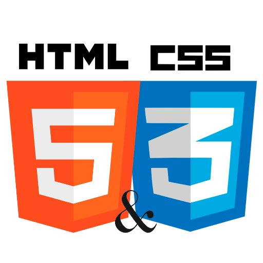

# HTTP 5111 HTML & CSS

A repo to store files for HTTP 5111. Frontend code to make the web beautiful.
Focusing on HTML 5 and CSS 3.

---

## Dropdown Menu
### HTML
```
<div class="dropdown">
  <button onclick="myFunction()" class="dropbtn">Dropdown</button>
  <div id="myDropdown" class="dropdown-content">
    <a href="#">Link 1</a>
    <a href="#">Link 2</a>
    <a href="#">Link 3</a>
  </div>
</div>
```

### CSS
  ```
  /* Dropdown Button */
.dropbtn {
  background-color: #3498DB;
  color: white;
  padding: 16px;
  font-size: 16px;
  border: none;
  cursor: pointer;
}

/* Dropdown button on hover & focus */
.dropbtn:hover, .dropbtn:focus {
  background-color: #2980B9;
}

/* The container <div> - needed to position the dropdown content */
.dropdown {
  position: relative;
  display: inline-block;
}

/* Dropdown Content (Hidden by Default) */
.dropdown-content {
  display: none;
  position: absolute;
  background-color: #f1f1f1;
  min-width: 160px;
  box-shadow: 0px 8px 16px 0px rgba(0,0,0,0.2);
  z-index: 1;
}

/* Links inside the dropdown */
.dropdown-content a {
  color: black;
  padding: 12px 16px;
  text-decoration: none;
  display: block;
}

/* Change color of dropdown links on hover */
.dropdown-content a:hover {background-color: #ddd;}

/* Show the dropdown menu (use JS to add this class to the .dropdown-content container when the user clicks on the dropdown button) */
.show {display:block;}
```
---

[W3 Schools HTML](https://www.w3schools.com/html/default.asp)

[W3 Schools CSS](https://www.w3schools.com/css/default.asp)
